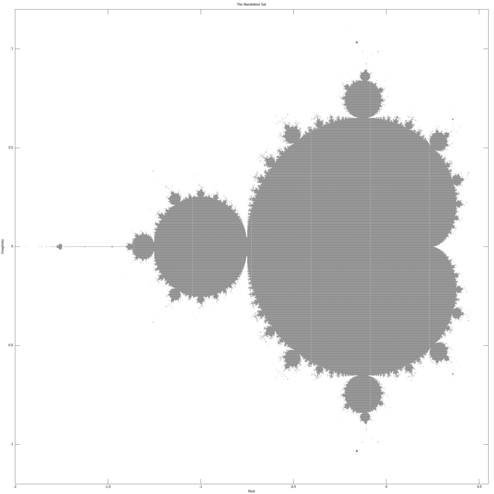
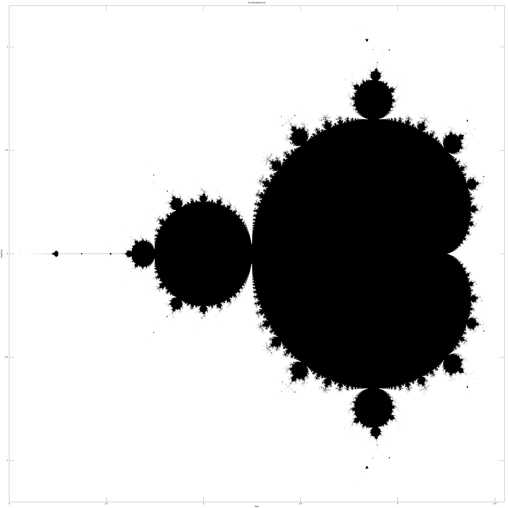
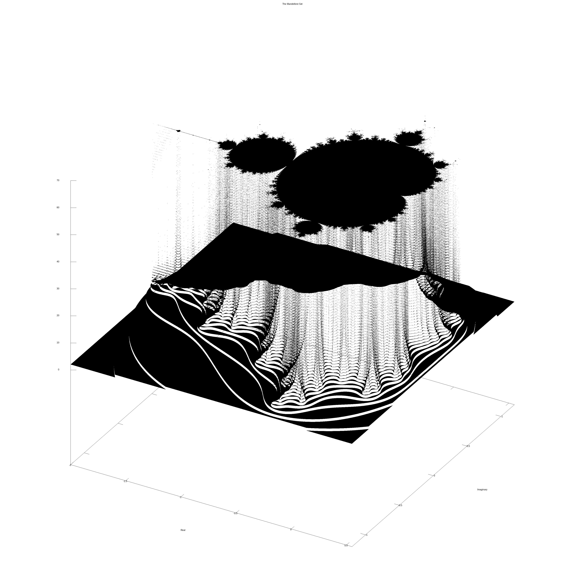
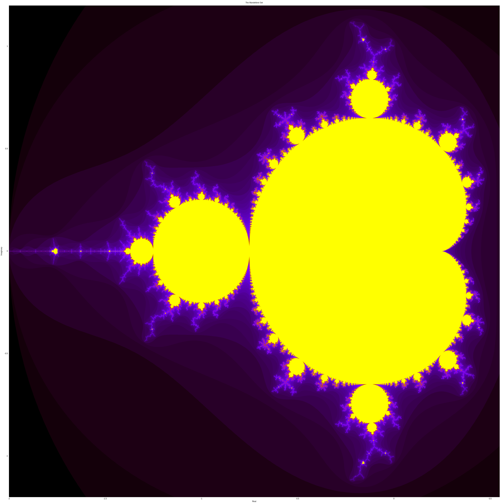
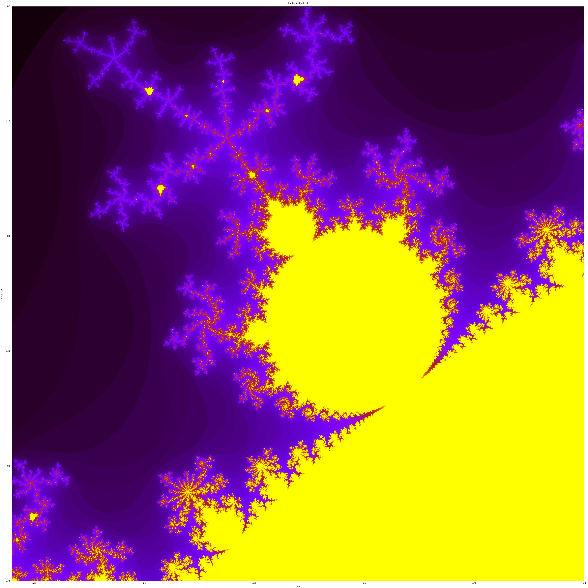
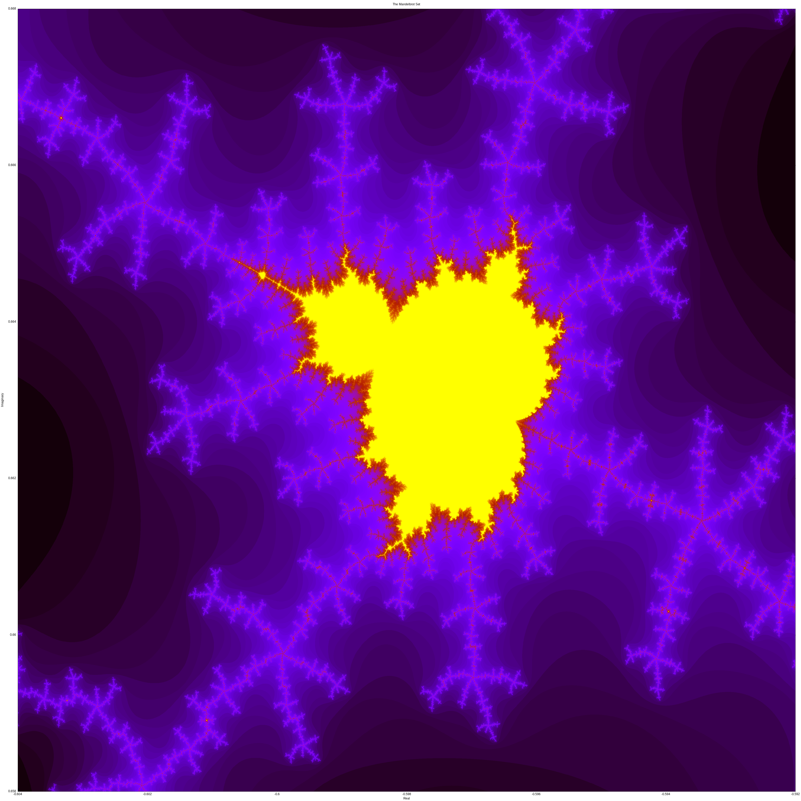
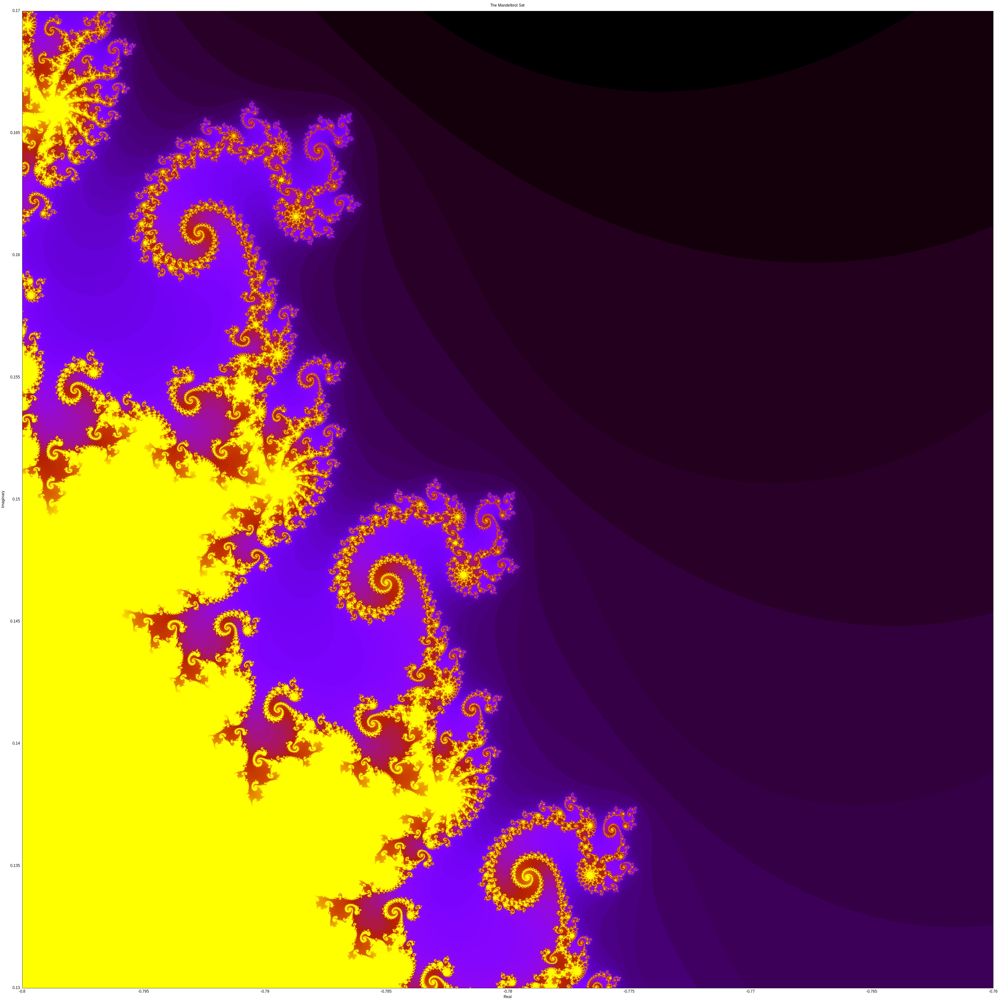
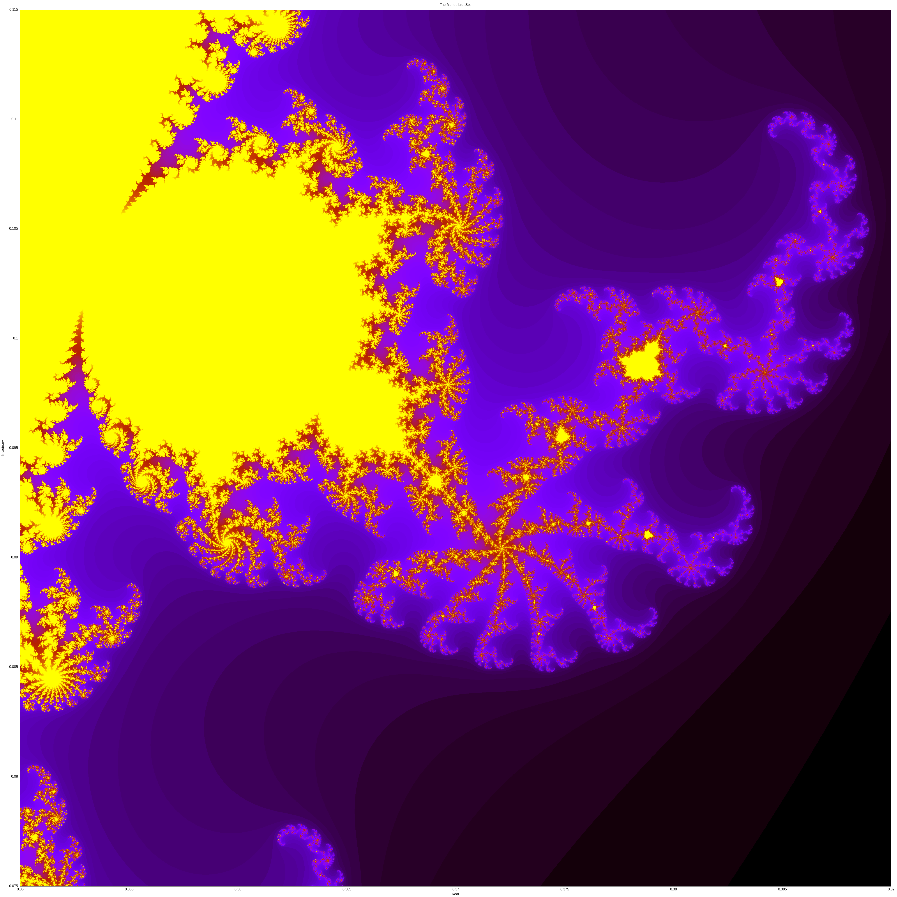
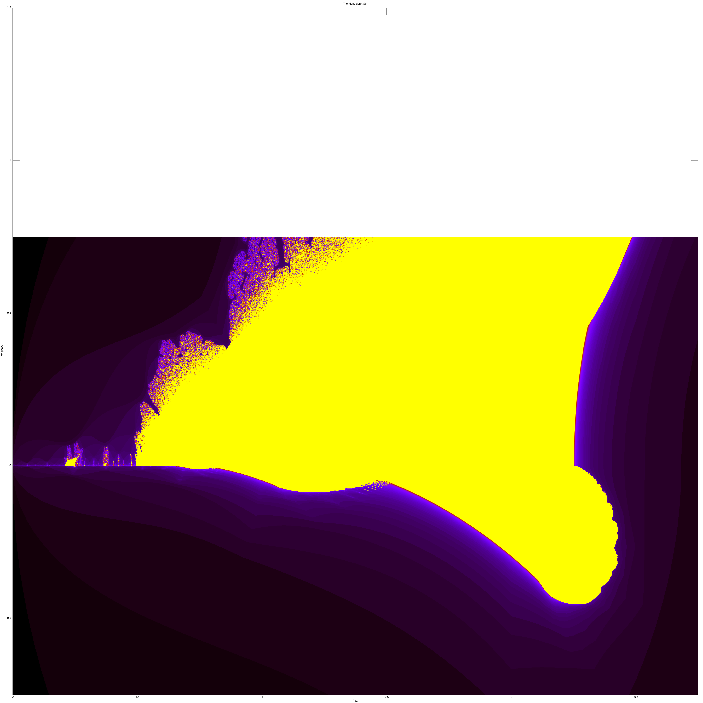
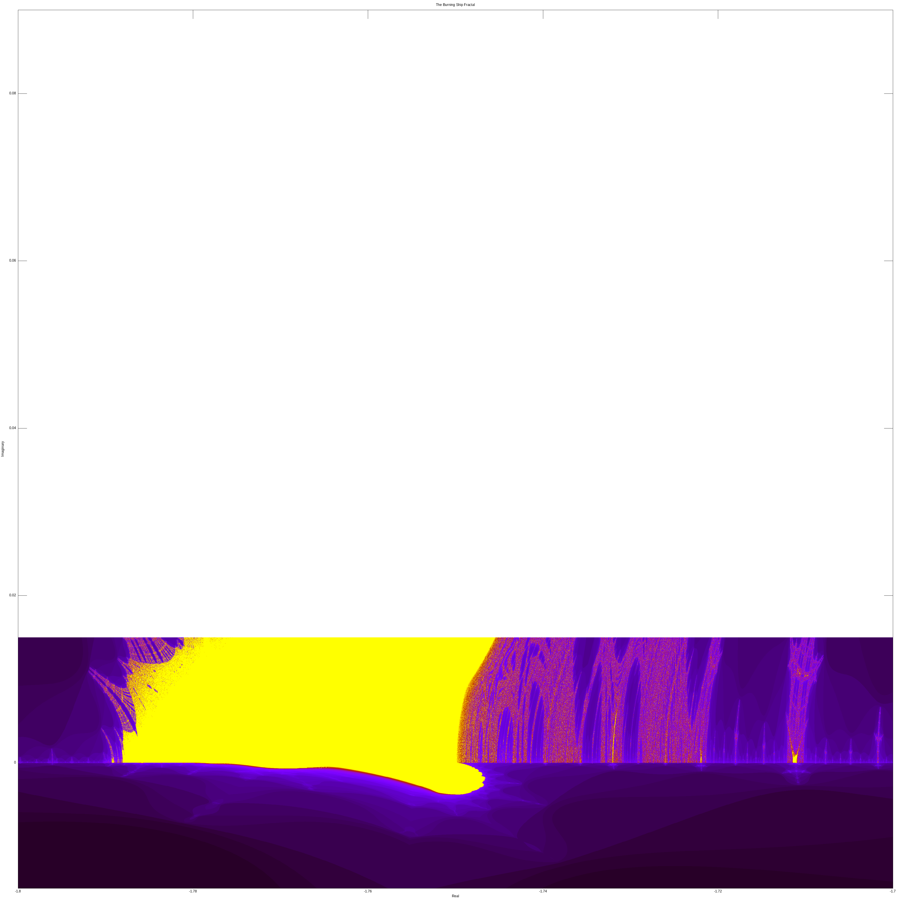

# mandelbrot
visualizing the Mandelbrot set. requires Gnuplot to run

### directions for now:

- get the appropriate view window/formula by uncommenting blocks in `mandelbrot.cpp` and `gnuplotter.gp` (I promise I will be better at this later)

- compile the code: `g++ -o mandelbrot.out mandelbrot.cpp`

- create the data file: `./mandelbrot.out`

- plot the data: `gnuplot -p gnuplotter.gp`

### basic Mandelbrot plot

similar to the original 1978 dot-matrix printout, just with higher resolution

### 2D Mandelbrot plot

higher res than the previous

### 3D Mandelbrot plot

where height represents number of iterations

### color Mandelbrot plot

where color represents number of iterations

### Mandelbrot 5-bulb

zooming in to one of the bulbs on the main cardioid

### Mandelbrot 5-bulb further zoom

further zoom-in of previous; shows some self-similarity 

### Mandelbrot seahorses

located between the main cardioid and main bulb

### Mandelbrot elephants

located in the valley of the main cardioid

### burning ship fractal

made by taking the absolute values of the components of z before squaring. unsure why Gnuplot didn't want to plot the whole thing, will fix later

### burning ship satellite

zoom in to the second-largest ship, found near the tail of the largest. if only we could actually see it

